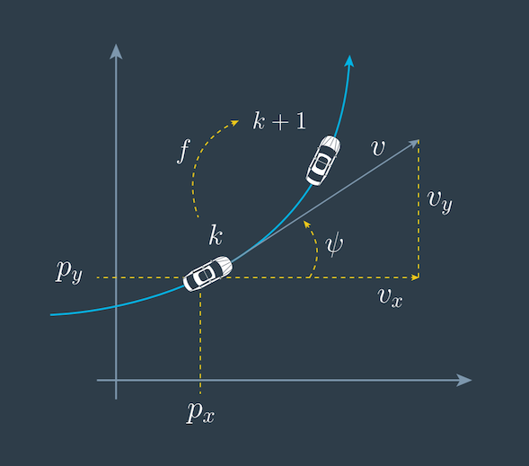
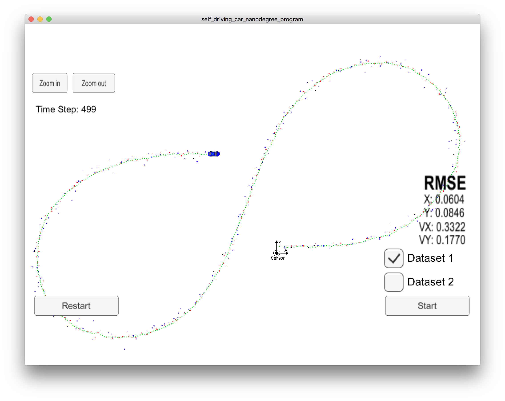

# Unscented Kalman Filter

This project is a part of Udacity's *Self-Driving Car Nanodegree* program. The
goal of the project is to implement Unscented Kalman Filter algorithm that
tracks a vehicle, using noisy radar and laser (lidar) measurements as input.

## Vehicle motion model

This project uses a non-linear motion model for the vehicle being
tracked. Unlike the previous project for
[Extended Kalman Filter](https://github.com/tindandelion/carnd-extended-kalman-filter-p6)
that assumed a linear motion model with a constant velocity, this project invokes a
model that accounts better for non-linear movements.

Specifically, this motion model is called *Constant Turn Rate and Velocity
(CTRV)*. It tracks the following components in the vehicle's state: 

|                 |                                  |
|:----------------|:---------------------------------|
| *px* | x-coordinate of the position (m) |
| *py* | y-coordinate of the position (m) |
| *v*             | tangential velocity magnitude (m/sec) |
| *ψ*             | yaw angle (rad) |
| *ψ'*            | yaw angle change rate (rad/sec) |

## Measurement models

Like in the previous project, the measurement data comes from two sources: lidar
and radar. Lidar provides the measurements for vehicle's position in Cartesian
coordinates *px* and *py*. Radar data comes in polar
coordinates [*ρ*, *ϕ*, *ρ'*] for distance, angle, and distance change rate. In
the project, we fuse the data from different sensors for best accuracy. 

## Filter performance

The implementation of UKF with the CTRV model gives better estimation accuracy,
compared to EKF from the previous project. Here are the RMSE value for vehicle's
position and velocity: 

| RMSE value      | UKF   | EKF   |
|:----------------|------:|------:|
| *px* | 0.060 | 0.097 |
| *py* | 0.085 | 0.086 |
| *vx* | 0.332 | 0.466 |
| *vy* | 0.177 | 0.472 |

## Evaluate process noise parameters

As a part of the project I had to choose the process noise parameters for
tangential acceleration and yaw rate acceleration, which are assumed to be
Gaussians with 0 mean and standard deviations *σa*,
*σψ''*. The suggested way of evaluating the accuracy of chosen values
is to calculate and analyze *Normalized Innovation Squared* (NIS). The idea is
that for good enough values of process noise parameters the value of NIS should
be below a certain threshold (NIS value is distributed as *χ2* with 2
or 3 degrees of freedom for lidar or radar, respectively).

Having tried different values, I came up with the following values for the
process noise parameters:

|                   |                       |
|:------------------|----------------------:|
| *σa*   | 0.5 m/s2   |
| *σψ''* | π/8 rad/s2 |

That gives the following NIS value graphs: 

Interpreting these graphs, we can see that most of NIS values lie below the
thresholds, with some minor fraction of outliers. That suggests that the
distribution parameters for the process noise are good enough. 

## Conclusions

- Unscented Kalman Filter is an extension of the idea of regular Kalman filter
  that allows using non-linear process and/or measurement models;
  
- Constant Turn Rate and Velocity motion model provides better tracking
  accuracy, compared to the basic linear motion model, because it accounts for
  more complex movement trajectories;
  
- One way to estimate the filter's consistency is to evaluate Normalized
  Innovation Squared values.
  

